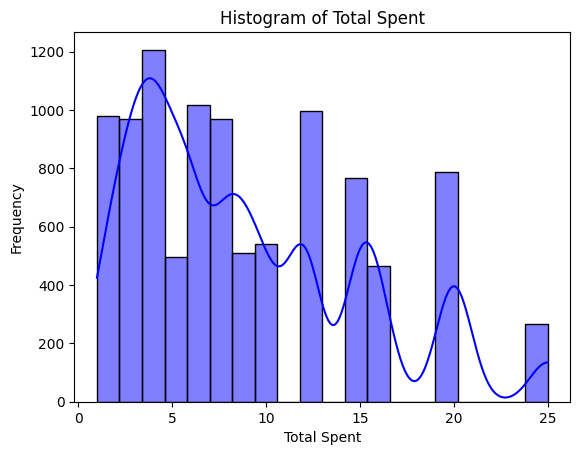
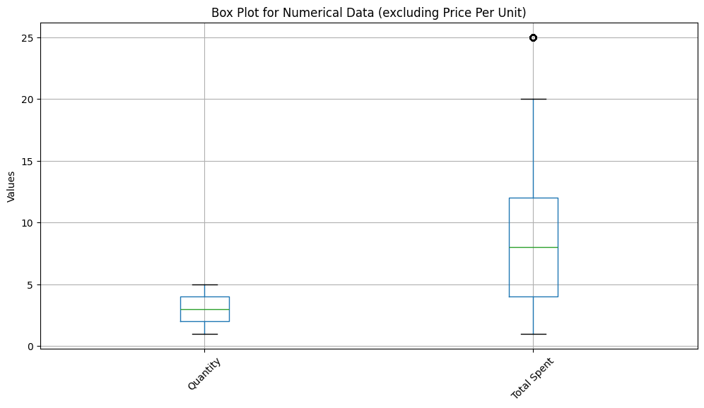
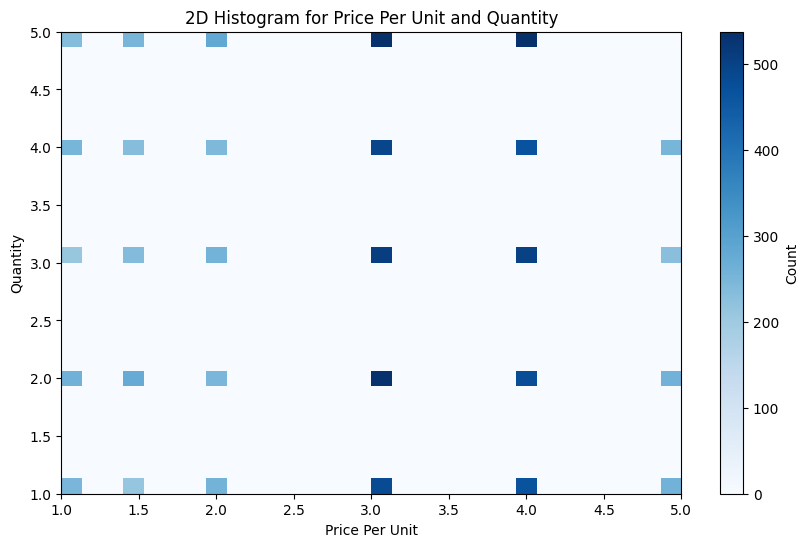
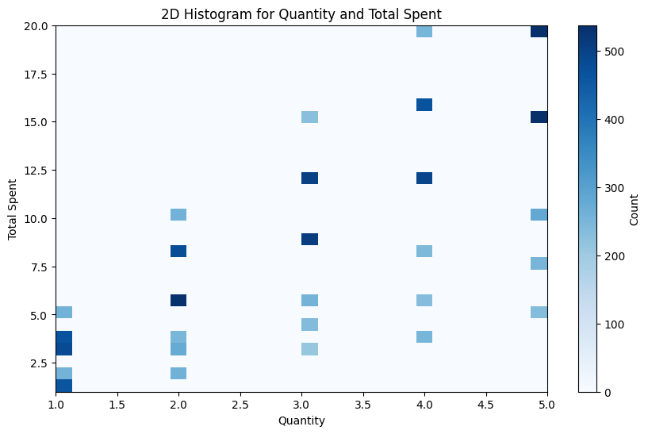

# Cafe-Data-Analysis-
An analysis of the Mavik-Cafe Data using python.

**Summary of Mavik_cafe_sales.csv for README**

The dataset contains almost **10,000** transaction records from a café, but it
has several inconsistencies and missing values. Below is an analysis of
its structure and issues:

**Dataset Overview**

-   **Transaction ID**: Unique identifier for each transaction.

-   **Item**: Name of the purchased item. Some values are missing or
    labeled as \"UNKNOWN\".

-   **Quantity**: Number of units purchased. Stored as text instead of
    numerical format.

-   **Price Per Unit**: Cost of a single unit. Some non-numeric values
    (e.g., \"ERROR\").

-   **Total Spent**: Calculated total cost, but some entries contain
    errors or discrepancies.

-   **Payment Method**: Method used to pay. Many missing values.

-   **Location**: Where the purchase was made (e.g., \"In-store\",
    \"Takeaway\"), but some entries are incorrect (e.g., \"ERROR\").

-   **Transaction Date**: Date of the purchase, but formatting
    inconsistencies and invalid entries exist

## Data Cleaning Steps

**Convert Data Types**:

-   Convert Quantity, Price Per Unit, and Total Spent to numeric format.

-   Ensure Transaction Date is in a standard date format (YYYY-MM-DD).

**Understanding Data Uniqueness and Inconsistencies**

To ensure data quality, we first analyse the uniqueness, and
inconsistencies present in the dataset by extracting unique values from
each column, except for Transaction ID and Transaction Date.

**1. Extracting Unique Values**

-   We retrieve all unique items in the Item column to identify possible
    errors or inconsistencies, such as mislabelled or missing products.

-   We then iterate through all columns in the dataset, skipping
    Transaction ID and Transaction Date, since these values are either
    unique to each row or not necessary for this analysis.

-   For each column, we extract and print the unique values, allowing us
    to detect anomalies such as spelling variations, unexpected
    placeholders (e.g., \"UNKNOWN\", \"ERROR\"), and formatting
    inconsistencies.

**2. Handling Mislabelled Data**

-   After identifying inconsistencies, we replace incorrect or
    mislabelled values with Nan to standardize the dataset.

**3. Handling Missing Values**

-   We determine the number of missing values in each column using the
    isnull() function.

-   If possible, missing values are filled based on logical assumptions
    or existing data patterns. Otherwise, rows with critical missing
    values are removed to maintain data integrity.

-   To address missing values in Item and Price Per Unit, we create a
    reference dictionary mapping items to their corresponding prices
    based on the available data and use it to impute missing values.

**4. Removing Irrelevant Columns**

-   For analysis purposes, we do not require the Location and Payment
    Method columns. These columns are dropped to streamline the dataset
    and focus on essential attributes.

This structured approach ensures the dataset is clean, consistent, and
ready for further exploratory data analysis.

## Univariate Analysis

Univariate analysis is the examination of a single variable at a time.
It helps us understand the distribution, central tendency, and spread of
the data. In our dataset, we perform univariate analysis on **Quantity**
and **Total Spent**, as these numerical columns are essential for sales
insights.

**1. Measures of Central Tendency**

-   **Mean (Average):** The sum of all values divided by the total
    number of observations. It gives a general idea of the data
    distribution.

-   **Median:** The middle value when the data is sorted. It is useful
    in the presence of outliers as it represents the central position of
    the dataset.

-   **Mode:** The most frequently occurring value. It helps identify
    common transaction patterns.

**2. Measures of Dispersion**

-   **Minimum & Maximum:** These values help us understand the range of
    data by showing the smallest and largest values.

-   **Standard Deviation:** Indicates how much the values deviate from
    the mean. A high standard deviation suggests more variability in
    sales transactions.

**3. Visualization for Distribution Analysis**

To better understand the distribution of Quantity and Total Spent, we
use the following plots:

-   **Histogram:** Shows the frequency distribution of values, helping
    us identify skewness, peaks, and common transaction amounts.

-   **KDE (Kernel Density Estimate) Plot:** A smoothed version of the
    histogram that helps visualize the probability density function of a
    variable.

By performing these analyses, we can detect patterns, outliers, and
anomalies, ensuring a better understanding of sales trends.

Analysis:

From the histogram of **Total Spent**, we can analyse the distribution:

1.  **Skewness:**

    -   The histogram appears to have a **right-skewed (positively
        skewed)** distribution.

    -   This is indicated by the longer tail extending towards higher
        values (right side).

2.  **Frequency Distribution:**

    -   The highest frequency of transactions occurs at lower spending
        amounts, around **0 to 5**.

    -   There are multiple peaks, suggesting a multi-modal distribution,
        possibly due to different pricing tiers for items.

3.  **Outliers & Spread:**

    -   Some transactions involve higher amounts (above **15-20**), but
        they are less frequent.

    -   This suggests that most purchases involve small spending
        amounts, while high-spending transactions are rare.

**Conclusion:**

The right skew indicates that **most customers spend small amounts**,
but a few transactions involve significantly higher spending, likely
from bulk purchases or premium items.

**Box Plot for Numerical Data (Excluding Price Per Unit)**

**Overview**

This box plot visualizes the distribution of two numerical variables:
**Quantity** and **Total Spent**. It provides key insights into their
spread, central tendency, and potential outliers.

**Key Observations**

1.  **Quantity:**

    -   Low variability with a compact range.

    -   No visible outliers.

    -   Median is slightly closer to the lower quartile.

2.  **Total Spent:**

    -   Higher variability with a wider range.

    -   One clear outlier above 25.

    -   Median is slightly skewed toward the lower quartile.

**Bar Chart: Number of Transactions per Month**

-   **Description:** A bar chart showing the total number of
    transactions for each month in 2023.

-   **Key Observations:**

    -   The number of transactions is relatively consistent across
        months, with February having the lowest (726) and October the
        highest (837).

    -   There are no drastic fluctuations, indicating stable transaction
        activity throughout the year.

-   **Usage:** Useful for identifying seasonal trends or irregularities
    in transaction volume.

## Bivariate Analysis

Total Quantity Sold for Each Item

The bar chart visualizes the total quantities of various items sold,
providing insights into their popularity or demand. The x-axis
represents the different items, while the y-axis shows the total
quantities sold. Each bar\'s height corresponds to the total quantity
sold for that specific item.

**Key Observations:**

1.  **Juice** is the most sold item with a total quantity of **4262**,
    indicating its high demand.

2.  **Smoothie** has the lowest sales with a total quantity of **3336**.

3.  Other items like **Sandwich (4133)** and **Coffee (3904)** also have
    significant sales, showing they are popular choices.

4.  Items such as **Cookie (3598)**, **Tea (3650)**, and **Salad
    (3819)** fall in the mid-range of sales.

**2. Total Income for Each Item**

This bar chart represents the total income generated by each item,
offering insights into revenue contributions.

-   **Key Insights**:

    -   *Salad* generates the highest income at **19,095**, despite not
        being the most sold item, indicating a higher price point.

    -   *Sandwich (16,532)* and *Smoothie (13,344)* also contribute
        significantly to revenue.

    -   Items like *Cake (10,404)* and *Juice (12,786)* show moderate
        income levels.

    -   The lowest revenue comes from *Cookie (3598)* and *Tea (5475)*.

-   **Purpose**:\
    This chart helps identify high-revenue items that are crucial to
    profitability and those that may need pricing or marketing
    adjustments

**3. Total Units Sold per Month**

Total Units Sold per Month

This bar chart shows the total number of units sold each month in a
year, highlighting sales trends over time.

-   **Key Insights**:

    -   The highest sales occurred in **December (2539 units)**,
        possibly due to seasonal demand.

    -   The lowest sales were in **February (2253 units)**, which may
        indicate a slower period.

    -   Sales remain relatively consistent across other months,
        averaging around **2400 units per month**.

-   **Purpose**:\
    This chart is helpful for identifying seasonal trends and planning
    marketing campaigns or inventory restocking accordingly

## Total Income per Month

This bar chart shows monthly income trends throughout the year.

-   **Key Observations**:

    -   The highest income is recorded in **December (7314)**, aligning
        with peak sales.

    -   February has the lowest income at **6644**, reflecting lower
        sales during this period.

    -   Monthly income remains stable throughout the rest of the year,
        averaging around **7000**.

-   **Purpose**:\
    This chart provides insights into revenue seasonality and helps
    businesses plan financial strategies effectively.

**Summary**

These visualizations provide actionable insights into product
performance and seasonal trends. They are crucial for decision-making in
areas such as inventory management, pricing strategies, and marketing
plans.

## Numerical - Numerical

This **2D histogram** shows the relationship between **Price Per Unit
(x-axis)** and **Quantity (y-axis)**, with colour intensity representing
the **frequency (count)** of occurrences.

-   **Dark blue bins** indicate higher counts (e.g., Price = 3, Quantity
    = 3).

-   Useful for identifying patterns, clusters, trends, and outliers in
    bivariate data.

-   Commonly applied in sales analysis to understand price-quantity
    relationships.

The provided image is a **2D histogram** that visualizes the
relationship between two variables: **Quantity** (x-axis) and **Total
Spent** (y-axis). The colour intensity represents the **count of
occurrences** for each combination of these two variables, with darker
shades indicating higher counts.

**Use in Exploratory Data Analysis (EDA)**

In EDA, this type of visualization is particularly useful for the
following purposes:

1.  **Understanding Relationships Between Variables**:

    -   The 2D histogram helps identify patterns or trends between the
        variables. For example, it can show how the total spending
        varies with different quantities purchased.

2.  **Detecting Clusters or Concentrations**:

    -   The colour intensity highlights areas where data points are
        concentrated, which can indicate common purchasing behaviours or
        popular quantity-price combinations.

3.  **Identifying Outliers or Rare Events**:

    -   Sparse or isolated bins with low counts may indicate unusual or
        rare combinations of quantity and total spending.

4.  **Data Distribution Across Two Dimensions**:

    -   It provides a binned frequency distribution for two variables
        simultaneously, offering insights into how they jointly behave.

## Scatter Plot

-   Spending appears to cluster at certain levels (e.g., 5, 10, 15, and
    20), suggesting that these amounts may represent common transaction
    values or price tiers.

-   No clear trend or seasonality is visible in the scatter plot,
    indicating that spending levels are relatively consistent over time
    without significant peaks or troughs.

-   The density of points suggests frequent transactions throughout the
    year.

This visualization is useful for identifying patterns in transaction
amounts but does not reveal causation or detailed temporal trends.

## Multivariate Analysis

The heatmap shows the correlation matrix, which highlights relationships
between variables:

-   **Quantity & Total Spent**: Strong positive correlation (0.69) ---
    buying more increases spending.

-   **Price Per Unit & Total Spent**: Positive correlation (0.61) ---
    higher prices lead to higher spending.

-   **Quantity & Price Per Unit**: Near-zero correlation (-0.058) --- no
    significant relationship.

The provided line chart is used to visualize and analyze the monthly
sales trends of different items over the year 2023. Here\'s how it is
typically utilized:

**Purpose of the Chart**

1.  **Sales Performance Analysis**:

    -   The chart helps identify which items perform well or poorly in
        terms of sales across different months.

    -   For example, Coffee and Cookies show high sales in most months,
        while Smoothies and Tea generally have lower sales.

2.  **Seasonal Trends and Demand Patterns**:

    -   It highlights seasonal variations in demand for specific items.

    -   For instance, Coffee peaks in October, possibly due to colder
        weather, while Juice shows relatively stable sales with slight
        increases in warmer months like June and July.

3.  **Comparative Analysis**:

    -   It allows for a comparison of sales performance between
        different items.

    -   The overlapping lines make it easy to see which item
        consistently outperforms others or fluctuates more.

4.  **Decision-Making Tool**:

    -   Businesses can use the insights from this chart to optimize
        inventory, marketing strategies, and promotions tailored to
        seasonal demand.

    -   For example, boosting Coffee promotions in October or focusing
        on Juice during summer months.

5.  **Trend Identification**:

    -   The chart helps spot long-term trends or anomalies in sales
        data.

    -   For example, if an item like Cake shows consistent growth or
        decline, businesses can investigate the reasons behind these
        trends

These charts are valuable tools for businesses to:

-   Identify top-performing items to focus on for inventory management
    and promotions.

-   Recognize seasonal trends to plan marketing campaigns.

-   Compare unit sales with revenue to assess pricing strategies.

-   Make data-driven decisions to optimize profitability and customer
    satisfaction.
